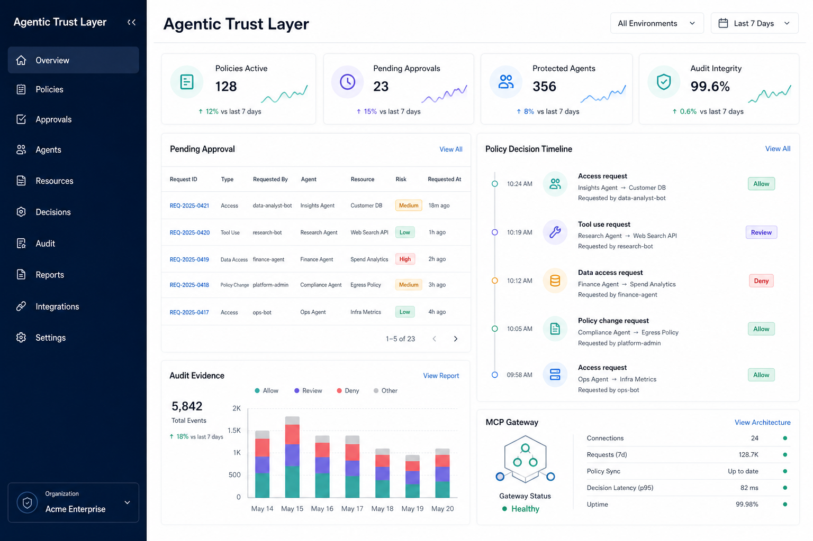

# Agentic Trust Layer



## Try the interactive demo

[Launch Trust Lab](https://agentic-trust-lab.ricardocalala.chatgpt.site) — a public, fictional demonstration of the Agentic Trust Layer, including governed agent actions, MCP tool controls, evidence trails, and an opt-in 3D Operations Center.

Created by Ricardo Calala with ChatGPT Codex.

An enterprise agent-forensics and governance foundation. It helps organizations decide what an agent may access, which actions need human review, and how to reconstruct verifiable evidence of every decision during an investigation.

This repository is a **portfolio concept and proof of concept**, intended to show how an organization could integrate agent governance into its existing security and compliance stack. It is a layer a company can adopt around its own agents and systems—not a replacement for its existing identity, security, or compliance frameworks. It is not represented as a production-ready security service.

The product vision is now centered on [agent activity forensics](docs/forensics-product-vision.md): trustworthy timelines, evidence integrity, and investigation-ready records for AI agents.

Read the [National Agentic Trust Fabric](docs/national-trust-fabric.md) for a country-wide public-sector architecture spanning agencies while preserving local authority and accountability.

## What it demonstrates

- **Policy-as-code:** default-deny authorization over agents, tools, resources, and data classifications.
- **Human control:** approval gates for consequential actions such as sending external communications or changing production data.
- **Trustworthy evidence:** append-only, hash-linked audit events that reveal tampering.
- **Enterprise design thinking:** clear separation between policy, execution approvals, and audit evidence.

## Quick start

Install dependencies, then run the build and test commands:

```sh
npm install
npm run build
npm test
```

To run the functional local MCP demonstration, see the [MCP integration guide](docs/mcp-integration.md).

Read the [governed customer-support agent use case](docs/use-case-customer-support.md) for a business-facing example of how a company could adopt the layer.

Read the [zero-trust cross-organization use case](docs/use-case-cross-organization.md) for an enterprise model spanning financial services, government, and other sensitive sectors.

Read the [evidence-based trust model](docs/trust-model.md) for the principle behind the product: AI supports verification, but trust is earned through evidence, policy, and accountability.

Read the [system architecture guide](docs/system-architecture.md) to see where the layer fits from the website and load balancer through applications, services, databases, and MCP tools.

Read the [threat model](docs/threat-model.md) and [SOC 2 readiness matrix](docs/soc2-readiness-matrix.md) for the enterprise security and compliance story.

Explore [policy examples](docs/policy-examples.md), the [fraud operations use case](docs/use-case-fraud-operations.md), the [integration blueprint](docs/integration-blueprint.md), and the [demo scenario](docs/demo-scenario.md).

Read the [digital forensics use case](docs/use-case-digital-forensics.md) for how integrity-protected agent records can support incident investigation.

Read the [lone-investigator fraud console prototype](docs/prototype-fraud-investigator-console.md) for the proposed single-user forensic workflow.

Read the [area-level financial-risk intelligence concept](docs/area-level-risk-intelligence.md) for the privacy-preserving, aggregate-first lead-verification direction.

## Example

```ts
import { TrustLayer } from "agentic-trust-layer";

const trustLayer = new TrustLayer([
  {
    id: "customer-email-review",
    effect: "require_approval",
    agents: ["support-agent"],
    actions: ["send"],
    resources: ["customer-email"],
    classifications: ["confidential"],
    reason: "A human reviewer must approve customer communication."
  }
]);

const decision = trustLayer.authorize({
  agentId: "support-agent",
  action: "send",
  resource: "customer-email",
  dataClassification: "confidential"
});
```

## SOC 2 readiness roadmap

SOC 2 is an independent audit of an organization and its operating controls; a codebase cannot be certified by itself. This project is designed to support readiness by mapping its controls to the audit evidence an organization would need.

| Trust-layer capability | SOC 2 readiness contribution |
| --- | --- |
| Default-deny policy engine | Logical access control and least privilege |
| Approval workflow | Change authorization and human oversight |
| Hash-linked audit log | Monitoring, traceability, and incident investigation |
| Data classification rules | Data handling and confidentiality controls |

To reach an audit-ready implementation, add identity-provider integration, encrypted durable storage, key management, role-based administration, retention policies, alerting, incident response procedures, disaster recovery testing, vendor management, and recurring control evidence reviews.

## Architecture

1. An agent proposes a tool use or data access request.
2. The policy engine evaluates the request against explicit rules.
3. The trust layer allows, denies, or holds the request for human approval.
4. Each decision is recorded in a hash-linked audit chain.

For the full enterprise use case, integration model, and control principles, read [the enterprise concept](docs/enterprise-concept.md).

## Next portfolio milestones

1. Package the library behind a REST API with authenticated tenants.
2. Add a policy-management dashboard and approval inbox.
3. Persist audit events in encrypted, append-only storage.
4. Integrate with an identity provider and central logging platform.
5. Write a control matrix, threat model, and evidence collection plan for SOC 2 readiness.
