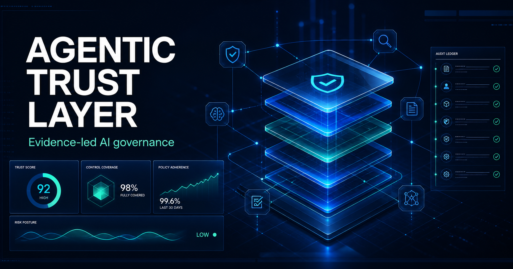

# Agentic Trust Layer

> Release: `1.0.1-alpha.beta` · Public demo: fictional data only · [Release notes](CHANGELOG.md) · [Security policy](SECURITY.md)



Agentic Trust Layer is an enterprise agent-governance and forensics proof of concept. It demonstrates how an organization can place a policy, approval, and evidence layer between AI agents and sensitive tools, data, or workflows.

Created by Ricardo Calala with ChatGPT Codex.

## Try the public experience

[Launch Trust Lab](https://agentic-trust-lab.ricardocalala.chatgpt.site) — a public, fictional, interactive experience featuring:

- Governed agent actions with allow, review, deny, and low-risk routing outcomes.
- An MCP Gateway simulation with policy rationale and forensic receipts.
- 3D trust and financial-risk operations simulations using synthetic aggregate data only.
- A 2035 global signal fabric with selectable regions, rotating telemetry, mission actions, and human-review boundaries.
- The Trust Operations Console for fictional policies, approvals, agents, evidence, MCP Gateway activity, and reports.

The public site does not use real people, agencies, records, locations, money, or risk signals.

## What this repository is

This repository contains two complementary surfaces:

| Surface | Purpose |
| --- | --- |
| TypeScript trust-layer library | Reference policy engine, approval workflow, tenant-aware REST API, MCP authorization tools, and encrypted append-only audit-store adapter. |
| Trust Lab | A public visual concept and interactive demonstration built entirely with locally generated fictional data. |

It is a portfolio concept and alpha proof of concept—not a certified security service or production decision system. It is intended to integrate around an organization’s own identity, security, compliance, and operational systems rather than replace them.

The product vision centers on [agent activity forensics](docs/forensics-product-vision.md): trustworthy timelines, evidence integrity, and investigation-ready records for AI agents. Read the [National Agentic Trust Fabric](docs/national-trust-fabric.md) for a country-wide public-sector architecture that preserves agency authority and accountability.

## Government and public-sector use

For public institutions, Agentic Trust Layer is a governance boundary—not a decision maker. It can help agencies make AI-assisted work auditable, policy-governed, and accountable while preserving each agency’s authority over its own people, records, and services.

It is designed around six public-sector principles:

1. **Lawful purpose:** every tool use or data request needs a defined mandate and operational purpose.
2. **Human accountability:** an AI agent may assist, but an authorized person retains consequential authority.
3. **Minimum necessary access:** policies constrain the agent, tool, action, data class, tenant, and scope.
4. **Evidence before action:** the system records policy, source references, uncertainty, approval, and outcome rather than treating an AI statement as proof.
5. **Agency autonomy:** a shared trust fabric can support interoperability without centralizing every agency’s records or forcing one agency to trust another’s AI output.
6. **Public confidence:** clear limits, privacy safeguards, independent oversight, and challenge/correction pathways matter as much as technical controls.

Start with the [Government Adoption Guide](docs/government-adoption-guide.md) for a clear operating model, roles, guardrails, pilot candidates, procurement questions, and phased rollout. The [National Agentic Trust Fabric](docs/national-trust-fabric.md) shows how this model could scale across public institutions without creating a single national decision engine.

## Current capabilities

- **Policy-as-code:** default-deny authorization over agents, tools, resources, and data classifications.
- **Human control:** approval gates for consequential actions such as sending external communications or changing production data.
- **Trustworthy evidence:** append-only, hash-linked audit events that reveal tampering.
- **Tenant-aware API foundation:** authenticated tenant boundaries, scoped approvals, and policy replacement endpoints.
- **Encrypted evidence adapter:** AES-256-GCM, newline-appended audit records with a hash-linked decision chain.
- **MCP governance reference:** action authorization and in-memory audit-integrity verification over standard input/output.
- **Enterprise design thinking:** clear separation between policy, execution approvals, and audit evidence.

## Run the reference services locally

Install dependencies, then run the build and test commands:

```sh
npm install
npm run build
npm test
```

Start the local MCP reference server after building:

```sh
npm run mcp
```

Start the tenant-scoped REST API by supplying a development JWT secret and a base64-encoded 32-byte audit key:

```sh
export TRUST_LAYER_JWT_SECRET="replace-with-at-least-32-characters"
export TRUST_LAYER_AUDIT_KEY_BASE64="$(openssl rand -base64 32)"
npm run api
```

The API listens on `http://localhost:8787` by default. See the [MCP integration guide](docs/mcp-integration.md) and [tenant REST API guide](docs/rest-api.md) for the exact boundaries, routes, scopes, and production hardening requirements.

Read the [governed customer-support agent use case](docs/use-case-customer-support.md) for a business-facing example of how a company could adopt the layer.

Read the [zero-trust cross-organization use case](docs/use-case-cross-organization.md) for an enterprise model spanning financial services, government, and other sensitive sectors.

Read the [evidence-based trust model](docs/trust-model.md) for the principle behind the product: AI supports verification, but trust is earned through evidence, policy, and accountability.

Read the [system architecture guide](docs/system-architecture.md) to see where the layer fits from the website and load balancer through applications, services, databases, and MCP tools.

Read the [threat model](docs/threat-model.md), [SOC 2 readiness matrix](docs/soc2-readiness-matrix.md), and [ISO 27001 and GDPR readiness matrix](docs/iso27001-gdpr-readiness.md) for the enterprise security, privacy, and compliance readiness story.

Read the [tenant REST API guide](docs/rest-api.md) for the functional backend foundation: authenticated tenant boundaries, policy management, approval inbox routes, encrypted append-only audit storage, and central logging adapters.

Explore [policy examples](docs/policy-examples.md), the [fraud operations use case](docs/use-case-fraud-operations.md), the [integration blueprint](docs/integration-blueprint.md), and the [demo scenario](docs/demo-scenario.md).

Read the [digital forensics use case](docs/use-case-digital-forensics.md) for how integrity-protected agent records can support incident investigation.

Read the [lone-investigator fraud console prototype](docs/prototype-fraud-investigator-console.md) for the proposed single-user forensic workflow.

Read the [area-level financial-risk intelligence concept](docs/area-level-risk-intelligence.md) for the privacy-preserving, aggregate-first lead-verification direction.

For government and public-sector audiences, read the [Government Adoption Guide](docs/government-adoption-guide.md) for public value, human-accountability, privacy, security, procurement, and phased-adoption guidance.

## Example

```ts
import { TrustLayer } from "agentic-trust-layer";

const trustLayer = new TrustLayer([
  {
    id: "customer-email-review",
    effect: "require_approval",
    agents: ["support-agent"],
    actions: ["send"],
    resources: ["customer-email"],
    classifications: ["confidential"],
    reason: "A human reviewer must approve customer communication."
  }
]);

const decision = trustLayer.authorize({
  agentId: "support-agent",
  action: "send",
  resource: "customer-email",
  dataClassification: "confidential"
});
```

## SOC 2 readiness roadmap

SOC 2 is an independent audit of an organization and its operating controls; a codebase cannot be certified by itself. This project is designed to support readiness by mapping its controls to the audit evidence an organization would need.

| Trust-layer capability | SOC 2 readiness contribution |
| --- | --- |
| Default-deny policy engine | Logical access control and least privilege |
| Approval workflow | Change authorization and human oversight |
| Hash-linked audit log | Monitoring, traceability, and incident investigation |
| Data classification rules | Data handling and confidentiality controls |

To reach an audit-ready implementation, add identity-provider integration, encrypted durable storage, key management, role-based administration, retention policies, alerting, incident response procedures, disaster recovery testing, vendor management, and recurring control evidence reviews.

See the [security policy](SECURITY.md), [threat model](docs/threat-model.md), [SOC 2 readiness matrix](docs/soc2-readiness-matrix.md), and [release notes](CHANGELOG.md) for the current alpha boundary and enterprise readiness path.

## Architecture

1. An agent proposes a tool use or data access request.
2. The policy engine evaluates the request against explicit rules.
3. The trust layer allows, denies, or holds the request for human approval.
4. Each decision is recorded in a hash-linked audit chain.

For the full enterprise use case, integration model, and control principles, read [the enterprise concept](docs/enterprise-concept.md).

## Enterprise foundation included

- Tenant-authenticated REST API reference implementation and scoped approval inbox.
- Policy-management API surface for an admin dashboard or backend-for-frontend.
- AES-256-GCM encrypted, append-only audit-store adapter.
- Pluggable identity-provider and central-log adapters.
- SOC 2, ISO/IEC 27001, and GDPR readiness control matrices, threat models, and evidence collection plans.
- MCP authorization and audit verification tools; approvals remain on the authenticated REST API rather than a shared-secret tool call.

## Documentation map

| Topic | Read this |
| --- | --- |
| Documentation index and release boundary | [docs/README.md](docs/README.md) |
| Product architecture and adoption | [System architecture](docs/system-architecture.md) · [Integration blueprint](docs/integration-blueprint.md) |
| API, identity, approvals, and audit storage | [Tenant REST API](docs/rest-api.md) · [MCP integration](docs/mcp-integration.md) |
| Security and readiness | [Security policy](SECURITY.md) · [Threat model](docs/threat-model.md) · [SOC 2 readiness matrix](docs/soc2-readiness-matrix.md) · [ISO 27001 and GDPR readiness](docs/iso27001-gdpr-readiness.md) |
| Government and public sector | [Government Adoption Guide](docs/government-adoption-guide.md) · [National Agentic Trust Fabric](docs/national-trust-fabric.md) |
| Forensics and use cases | [Forensics vision](docs/forensics-product-vision.md) · [Use cases](docs/README.md#use-cases-and-concepts) |
