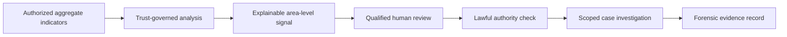

# Concept: Area-Level Financial-Risk Intelligence

## Purpose

Area-Level Financial-Risk Intelligence helps authorized public-sector financial-crime teams recognize where fragmented, lawful, aggregate evidence may justify closer human review. It does not claim that a crime is occurring, identify people without authority, or use covert physical-world surveillance.

The Agentic Trust Layer governs how signals are accessed, analyzed, explained, and escalated, so that investigation begins with accountable evidence rather than blind trust in an AI conclusion.

## The problem

Financial crime can be difficult to recognize when relevant signals are isolated across regulated reporting, licensing, inspections, public registries, and internal case systems. No single source may establish wrongdoing. A government team may need a way to notice an unusual pattern while preserving privacy, legal limits, and the presumption that a pattern is not proof.

## The concept

The system produces an **area- or sector-level review signal**. It describes an unusual combination of approved, aggregate indicators and shows the sources, limitations, and uncertainty behind it.

It does not output a declaration that money laundering is occurring. It outputs a bounded recommendation: a qualified investigator may decide whether a lawful, proportionate review is warranted.

## Authorized signal categories

The production system should use only information that the organization is legally authorized to process, with clear data ownership and retention rules. Examples may include aggregated regulated reports, public corporate and licensing records, aggregate inspection outcomes, internal case trends, and sector-level economic indicators.

The system should not use concealed tracking, scrape private communications, or access identifiable records solely because an AI generated a geographic risk signal.

## Safeguarded workflow

1. Approved sources provide aggregate, purpose-limited indicators.
2. The trust layer verifies source provenance, classification, policy, and permitted use.
3. The analytics component identifies a pattern worth review and expresses its uncertainty.
4. The system creates an explainable lead containing only the minimum necessary aggregate context.
5. An authorized investigator reviews the signal and decides whether it merits further action.
6. Identifiable records can be requested only under the applicable legal authority and case scope.
7. Every access, inference, reviewer decision, and source reference is stored in a forensic record.

## Trust requirements

| Requirement | Why it matters |
| --- | --- |
| Aggregate-first analysis | Reduces privacy risk and avoids premature individual targeting |
| Explainable signals | Lets reviewers see the basis, limitations, and uncertainty |
| Human authorization | Keeps material investigative decisions accountable |
| Purpose and authority checks | Prevents data reuse outside lawful scope |
| Data minimization | Limits collection and disclosure to what is necessary |
| Immutable audit history | Supports investigation, oversight, and later challenge |
| Independent evaluation | Tests accuracy, bias, privacy impact, and misuse risk |

## Prototype demonstration

The prototype can use synthetic, non-real data from a fictional region. It would show several aggregate indicators, an AI-generated explanation of why the combination merits review, a human review panel, a policy gate for requesting more records, and a complete forensic timeline.

This demonstrates the essential value without making claims about real people, real places, or real criminal activity.

## Product promise

The Agentic Trust Layer does not make hidden wrongdoing visible through omniscience. It makes authorized evidence easier to connect, challenge, and act on responsibly—while preserving the controls that prevent an AI signal from becoming an unchecked accusation.
