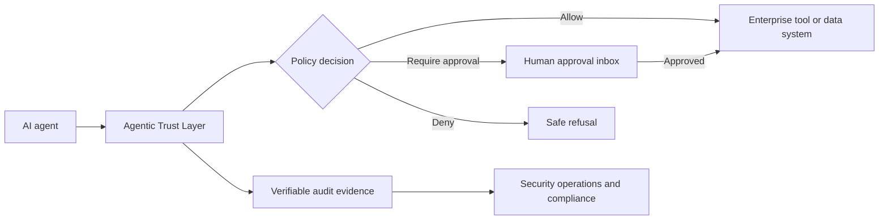

# Enterprise Concept: Agentic Trust Layer

## The problem

Organizations are adopting AI agents that can search internal knowledge, call business systems, and take actions. Traditional access control is built around human users, not autonomous software that can chain tools and make decisions. The Agentic Trust Layer provides a common control point between an agent and the systems it wants to use.

## The concept

The trust layer sits in front of every agent tool call. It evaluates context-aware policy, applies a proportionate approval requirement, and records a verifiable decision trail. It does not replace an organization's identity, security, data, or logging platforms; it connects to them. Its value is as an integration layer: a company retains its own agents, systems, and governance standards while gaining a consistent trust boundary for agent actions.

## Key use cases

### Customer support agent

The agent may read approved internal knowledge and draft a customer response. Sending the message, issuing a refund, or accessing sensitive account history requires a human approval based on policy and risk.

### Finance operations agent

The agent can reconcile invoices and prepare payment proposals. It cannot release a payment without segregation-of-duties checks and an authorized approver.

### Engineering operations agent

The agent can summarize alerts and open tickets. Production configuration changes require a change record, scoped access, and human approval.

## Decision inputs

Every action is evaluated using a consistent context:

- Agent identity and assurance level
- Requested tool and operation
- Target system or data resource
- Data classification and residency requirements
- Tenant, user, and session context
- Action impact, amount, and reversibility
- Existing approvals and operational conditions

## Integration model

| Existing enterprise capability | Trust-layer integration |
| --- | --- |
| Identity provider | Supplies agent and reviewer identity, roles, and tenant boundaries |
| API gateway or tool registry | Routes agent tool calls through policy enforcement |
| Data catalog | Supplies classifications, ownership, and handling requirements |
| Ticketing or workflow platform | Hosts approval requests and separation-of-duties checks |
| SIEM and audit platform | Receives signed decision events for monitoring and evidence |
| Key management platform | Protects credentials, audit signatures, and encrypted records |

## Control principles

1. **Default deny.** An agent receives only explicitly granted authority.
2. **Least privilege.** Policies scope access to a tool, action, data class, and tenant.
3. **Human accountability.** High-impact actions pause for the right reviewer.
4. **Continuous verification.** Each request is evaluated at the moment of use, not only at sign-in.
5. **Verifiable history.** Decisions and approvals become durable, integrity-protected evidence.
6. **Safe failure.** Missing context, unavailable policy, or audit failure results in denial or escalation.

## SOC 2 readiness perspective

This concept supports an eventual SOC 2 program by creating technical evidence for access control, change authorization, monitoring, and confidentiality. Certification would require the operating company—not merely this software—to implement and demonstrate the full set of relevant controls through an independent audit.

## Adoption path

1. Start with one low-risk agent and read-only tools.
2. Add data classification and centralized audit export.
3. Introduce approval gates for high-impact actions.
4. Connect enterprise identity, change management, and security operations.
5. Establish control owners, review cycles, testing, and audit evidence collection.
