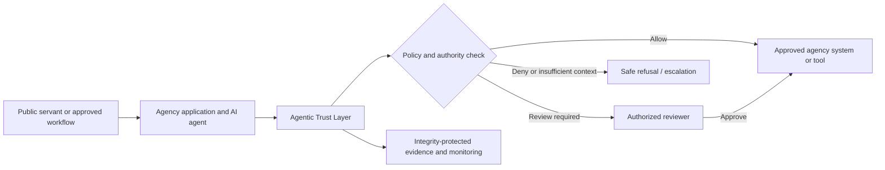

# Government Adoption Guide

> Current for `1.0.2-alpha.beta` · Government-friendly concept and implementation guidance. This is not legal advice, a procurement authorization, a certification claim, or a substitute for applicable law, policy, due process, or human judgment.

## Executive summary

Agentic Trust Layer is a proposed governance boundary for AI agents used by public institutions. It answers a simple operational question: **before an AI agent accesses a system, uses a tool, handles sensitive information, or proposes an action, how does the institution prove that the action was authorized, reviewable, and recorded?**

The layer does not replace an agency’s case-management system, identity provider, records authority, security operations center, or human decision maker. It sits between an AI agent and the systems that agent wants to use. It applies policy, pauses high-impact work for a qualified reviewer, and preserves evidence of what was requested, what policy applied, what was decided, and who—if anyone—approved the next step.

The public Trust Lab is a fictional educational demonstration. It uses no real agency, person, location, case, financial, or operational data.

## What government leaders gain

| Public-sector need | Agentic Trust Layer response |
| --- | --- |
| Accountability for AI-assisted work | Links an action to a workload identity, policy, decision, approval, and integrity-protected audit event |
| Clear human authority | Routes consequential or ambiguous actions to an accountable human rather than treating an AI output as a final decision |
| Cross-agency collaboration without blanket trust | Uses purpose, tenant, policy, tool, data classification, and time-bound boundaries before exchange |
| Investigable records | Supports reconstruction of an AI agent’s proposed actions and the controls that governed them |
| Privacy and proportionality | Encourages data minimization, purpose limitation, classification-aware policy, and aggregate-first analysis |
| Safer tool use | Evaluates an agent’s proposed MCP/API action before downstream systems receive it |

## The operating model

The intended rule is straightforward: an AI agent can assist with retrieval, drafting, comparison, summarization, and low-risk reversible routing inside an approved scope. It cannot make a final consequential decision about a person, payment, benefit, enforcement outcome, legal status, eligibility, or rights.

## Roles and accountability

| Role | Typical accountability |
| --- | --- |
| Executive sponsor | Defines mission scope, public value, funding, and risk tolerance |
| Program owner | Owns the service outcome and makes sure the use case stays within its mandate |
| Information owner | Approves what data may be used, its classification, retention, and sharing conditions |
| Security authority | Sets identity, access, logging, incident, and key-management requirements |
| Privacy/legal advisor | Confirms applicable legal authority, privacy impact assessment, notices, retention, and data-subject obligations |
| AI/workflow owner | Maintains the agent’s instructions, tool inventory, testing, and fallback behavior |
| Human reviewer | Makes accountable decisions for actions that require approval |
| Auditor/oversight function | Independently examines evidence, controls, exceptions, and corrective actions |

The same person should not design a policy, grant themselves elevated access, and approve their own high-impact request. Separation of duties should be explicit in the production approval workflow.

## Government safeguards by design

### Human authority and due process

- Do not use model output as the sole basis for a decision that materially affects a person.
- Define which role may approve which action, with authority, training, and escalation paths recorded.
- Preserve a reason, policy reference, evidence references, uncertainty, and reviewer decision for consequential outcomes.
- Provide challenge, correction, appeal, or redress processes where law or agency policy requires them.

### Privacy, proportionality, and records stewardship

- Start with the minimum authorized data, then broaden scope only when a documented legal authority and purpose require it.
- Prefer aggregate, de-identified, or synthetic data during discovery and pilot stages.
- Keep the source system authoritative; record references and provenance instead of copying more information into the trust layer than is needed.
- Set retention, disclosure, records-management, and cross-border transfer rules before operating with real records.

### Security and operational resilience

- Verify workforce and workload identity with managed identity services; do not rely on agent-provided names alone.
- Fail closed or escalate when policy, identity, or audit integrity cannot be verified.
- Protect audit encryption keys in managed key infrastructure, centralize monitoring, and rehearse incident and recovery procedures.
- Assess downstream tools, MCP servers, vendors, and cloud services before they handle protected information.

## Suitable first pilots

| Pilot | Why it is appropriate | Boundaries |
| --- | --- | --- |
| Internal policy and knowledge assistant | Read-only use with readily reviewable sources | No case decisions; only approved internal knowledge |
| Service-document completeness check | Identifies missing documents and drafts a checklist | Staff make final eligibility or service decisions |
| Security operations briefing assistant | Summarizes approved alerts and drafts an incident timeline | Does not change production systems without change control |
| Procurement or grant drafting assistant | Organizes source material and drafts non-binding language | No award, payment, or eligibility decision |
| Aggregate program-insight review | Compares authorized, non-identifying metrics and surfaces uncertainty | No individual targeting or enforcement conclusion |

Avoid starting with policing, benefits adjudication, payments, immigration, child protection, employment, enforcement, or other high-impact decision systems. Those domains may become candidates only after legal authority, privacy impacts, fairness, security, human oversight, and appeal requirements are independently assessed.

## Phased adoption plan

### Phase 0 — mandate and guardrails

Define the problem, public value, accountable executive, legal authority, information classification, prohibited actions, success measures, and exit criteria. Record whether the proposed processing requires a privacy impact assessment, security review, records review, or other statutory process.

### Phase 1 — fictional and synthetic validation

Use the public Trust Lab or agency-local synthetic data to demonstrate policy outcomes, review gates, evidence timelines, and staff workflow. Confirm that staff understand what the system can and cannot decide.

### Phase 2 — low-risk, read-only pilot

Connect one agency-owned source with managed identity, narrow purpose, tenant isolation, central logging, and a documented reviewer process. Measure accuracy, denial rate, review workload, operator feedback, and evidence completeness.

### Phase 3 — limited governed actions

Add carefully scoped actions that are reversible and reviewable. Require approval for external communication, sensitive access, record changes, or any action with material operational impact. Test incident response, rollback, and audit export.

### Phase 4 — scale only with evidence

Expand to additional agencies or tools only after independent control testing, privacy/legal review, training, operating evidence, procurement approval, and governance sign-off. Reassess the risk model when the data, users, tools, or automation level changes.

## Questions for procurement, security, and oversight review

1. What public purpose and legal authority justify the proposed agent activity?
2. What data will be accessed, where does it reside, and what is the minimum necessary scope?
3. Who owns the policy, the source data, the agent, the approval workflow, and incident response?
4. Which actions are always denied, and which actions always require a human reviewer?
5. How is workload identity proven, and how are reviewers authenticated and separated from requesters?
6. How will the agency inspect evidence, correct errors, handle appeals, and preserve required records?
7. Which vendors, MCP tools, APIs, models, or cloud services are involved, and what data may each receive?
8. What happens if identity, policy evaluation, audit integrity, or a downstream service fails?
9. How will performance, bias, privacy impacts, security events, and operational exceptions be measured and reported?
10. What evidence supports the decision to continue, scale, pause, or retire the pilot?

## What the alpha does and does not provide

The reference implementation includes a policy engine, approval workflow, tenant-scoped REST API, encrypted append-only audit-store adapter, and an MCP authorization reference. The public Trust Lab offers a visual simulation of those concepts with fictional data.

It does **not** provide a certified ISMS, a deployed government identity integration, a production case-management platform, a hosted multi-tenant service, a real-time surveillance capability, a legal-authority determination, or autonomous consequential decisions. Production adoption requires agency-specific engineering, procurement, security, privacy, legal, records, accessibility, and operations work.

## Related documentation

- [National Agentic Trust Fabric](national-trust-fabric.md)
- [System architecture](system-architecture.md)
- [Area-level financial-risk intelligence](area-level-risk-intelligence.md)
- [Threat model](threat-model.md)
- [SOC 2 readiness matrix](soc2-readiness-matrix.md)
- [ISO/IEC 27001 and GDPR readiness matrix](iso27001-gdpr-readiness.md)
