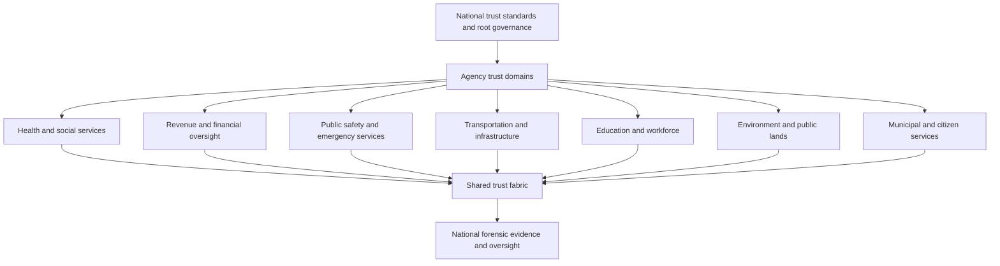

# National Agentic Trust Fabric

## Vision

A country-wide Agentic Trust Fabric gives public institutions a common way to govern and investigate AI-agent activity without centralizing every agency's data or authority. It is a shared verification, policy, approval, and forensic-evidence layer—not a single national AI that decides what is true.

Each public institution retains legal responsibility for its own decisions, records, staff, and services. The fabric makes cross-government AI use more accountable by applying consistent trust rules at the boundary between an agent and a government system.

## National architecture

## Shared national capabilities

| Capability | National role | Agency role |
| --- | --- | --- |
| Identity and workload assurance | Define common assurance standards | Verify staff, services, and agents locally |
| Source provenance | Set requirements for authorized-source metadata | Register and maintain approved data sources |
| Policy framework | Provide interoperable policy patterns | Define sector-specific authority and restrictions |
| Human approval | Define accountable-decision principles | Assign lawful reviewers and escalation paths |
| Forensic evidence | Set retention, integrity, and export standards | Retain and investigate agency records |
| Cross-agency access | Require purpose, minimization, and authorization | Approve only bounded exchanges |

## Sector applications

### Health and social services

Agents can help locate program guidance, identify missing documentation, and prepare case summaries. They should not make final eligibility, care, or benefit decisions without the lawful process and an accountable official.

### Revenue and financial oversight

Agents can reconcile records, identify anomalies, and draft compliance work. High-impact actions such as payment changes, enforcement decisions, or disclosures remain authority-gated and reviewable.

### Public safety and emergency services

Agents can synthesize approved operational information, help coordinate resources, and surface conflicts in data. They must not replace legal judgment, due process, or accountable command decisions.

### Transportation and critical infrastructure

Agents can monitor approved telemetry, prioritize maintenance work, and support incident coordination. Changes to safety-critical systems require strong authorization, dual control, and forensic recording.

### Education and workforce services

Agents can assist with information access and operational administration. Policies should prevent inappropriate access to protected learner or employee records and preserve appeal processes for material outcomes.

### Environment, agriculture, and public lands

Agents can assess observations, organize permits, and support inspections. The trust fabric preserves the source record and decision rationale when action affects communities, land use, or regulated entities.

### Municipal and citizen services

Agents can improve service navigation, document intake, and language access. The layer ensures that data sharing is minimized and that citizen-impacting actions remain explainable and contestable.

## Cross-agency truth model

No agency must accept another agency's AI output as unquestioned fact. Instead, an output is accompanied by a verifiable evidence package:

- Source-system references and provenance
- The policy and authority that permitted access
- Model and workflow version information
- Confidence and uncertainty indicators
- Conflicting or missing evidence
- Human reviewer and final accountable decision
- Integrity-protected audit history

The receiving agency independently evaluates whether it has authority to use the information. This creates interoperability without forced trust.

## Governance and safeguards

1. Publish a national baseline for AI-agent identity, logging, approval, and evidence integrity.
2. Give each agency a separate trust domain and policy authority.
3. Enforce data minimization, purpose limitation, jurisdiction, and retention requirements.
4. Require independent oversight, audits, and appeal pathways for material public-impact decisions.
5. Prohibit the use of agent output as the sole basis for high-impact decisions about people.
6. Test for bias, security failures, prompt injection, and data-provenance gaps.
7. Provide a lawful incident-investigation and correction process.

## Phased adoption

1. Establish standards and pilot in a low-risk, read-only service.
2. Add agency-local policy enforcement and forensic records.
3. Enable limited, purpose-bound cross-agency workflows.
4. Expand to critical operational systems only after independent security, privacy, and operational validation.

## The central promise

The fabric does not claim to create unquestionable truth. It creates a government-wide process for showing **what an agent relied on, what authority it had, what it did, who reviewed it, and how the record can be verified.**
