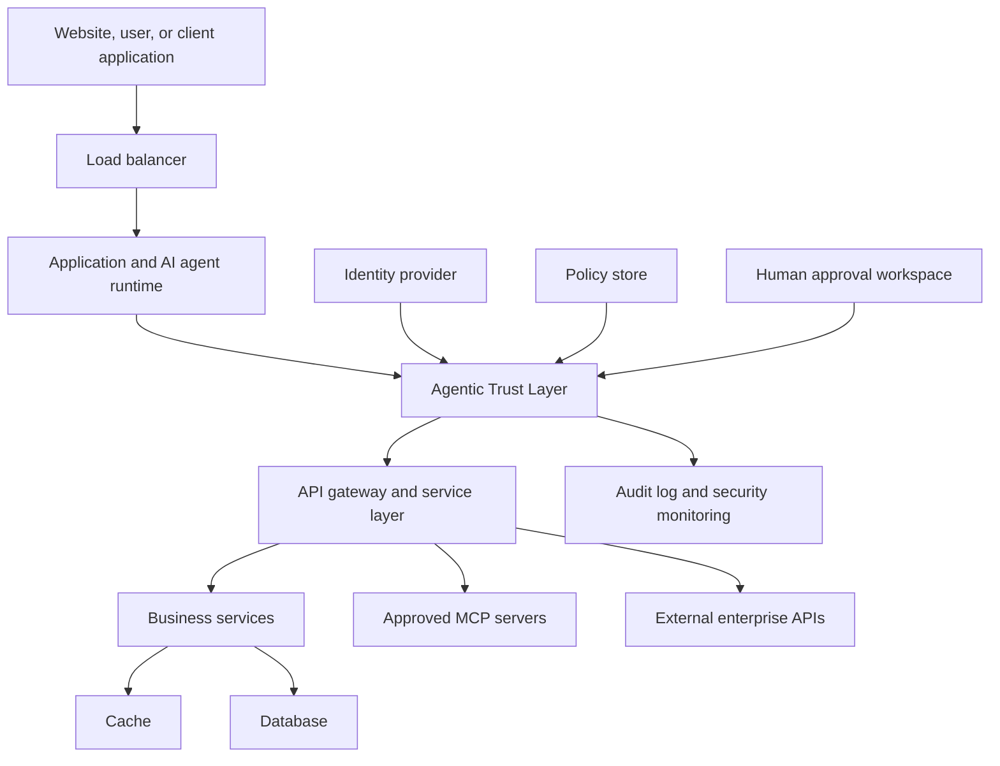

# System Architecture: Where the Agentic Trust Layer Fits

## Placement

The Agentic Trust Layer belongs in the application and integration path. It sits after a request has been routed to the application or AI agent, and before that agent can reach sensitive internal systems, external APIs, or MCP servers.

It is not a replacement for a load balancer, cache, database, identity provider, API gateway, or network controls. It adds agent-specific policy enforcement on top of those existing layers.

## Request flow

1. A user interacts with a website, application, or automated workflow.
2. The load balancer routes the request to a healthy application instance.
3. The application invokes an AI agent when the task needs reasoning, retrieval, or an automated action.
4. Before the agent uses a tool, reads sensitive data, or triggers an external action, it sends the proposed request to the Agentic Trust Layer.
5. The trust layer verifies the workload identity and tenant context, evaluates policy, and records an audit event.
6. The trust layer allows the request, denies it, or sends it to a human approval workflow.
7. Only allowed or approved requests reach the API gateway, business services, MCP servers, database workflows, or external systems.

## Responsibilities by layer

| Layer | Primary responsibility | Agentic Trust Layer role |
| --- | --- | --- |
| Website and client | User experience and user authentication | Pass approved user context into the application |
| Load balancer | Traffic routing, availability, and scaling | No policy decision; routes traffic to the application |
| Application and agent runtime | Business workflow and model orchestration | Proposes agent actions for policy evaluation |
| Agentic Trust Layer | Agent authorization, approvals, and audit evidence | The decision and governance boundary |
| API gateway | Service authentication, routing, and rate limits | Receives only approved downstream calls |
| Business services | Domain logic such as payments, support, or case management | Enforce their own service-level authorization as defense in depth |
| Cache | Fast retrieval of non-authoritative or derived data | Must not bypass source-of-truth authorization |
| Database | Durable application records | Retains independent access controls and encryption |
| MCP servers and external APIs | Agent tools and third-party capabilities | Exposed only through allowlisted, policy-governed access |
| Identity provider | Workforce, customer, workload, and reviewer identity | Supplies verified claims used in evaluation |
| Audit and security monitoring | Detection, investigation, and compliance evidence | Receives integrity-protected trust-layer events |

## Deployment options

### Embedded SDK

The application calls a trust-layer library before each agent tool call. This is the fastest adoption path, but the application must use it correctly.

### Central policy service

Applications call a dedicated trust-layer service over the network. This gives central policy management, consistent audit collection, and tenant isolation.

### MCP gateway

The trust layer acts as the MCP-facing gateway. It filters tool discovery and evaluates every tool invocation before forwarding permitted calls to downstream MCP servers. This is the strongest enforcement model for enterprise agent ecosystems.

## Defense in depth

The trust layer should never be the only control. A secure deployment combines it with identity management, API authorization, network segmentation, database permissions, encryption, secrets management, monitoring, backups, and incident-response procedures. If the trust layer is unavailable or cannot verify policy, it should deny or escalate high-risk agent actions rather than allow them by default.
